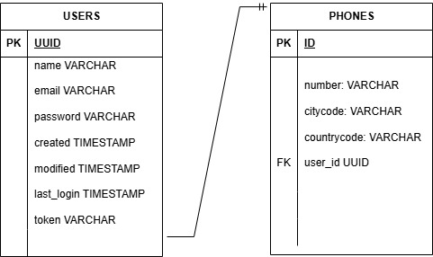
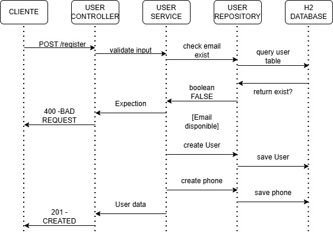

# Proyecto Registro de Usuarios

## Tecnologías utilizadas

- **Lenguaje:** Java 21
- **Framework:** Spring Boot 4.0
    - Spring Web
    - Spring Data JPA
    - Spring Validation
    - H2 Console
- **Base de datos:** H2 (en memoria)
- **Lombok** para generación de código automático
- **Seguridad:** JSON Web Tokens (JJWT)
- **Testing:**
    - Spring Boot Test
    - Testcontainers (JUnit 5, PostgreSQL)
- **Build:** Gradle

---

## Modelo de datos

> Diagrama de clases que muestra las entidades `User` y `Phone` y su relación 1:N.

---

## Diagrama de secuencia: Registro de usuario

> Diagrama de secuencia mostrando el flujo de registro de usuario.  
> Incluye ambos caminos:
> - **Éxito:** usuario y phones creados.
> - **Error:** email ya existente, devuelve HTTP 400.

---

## Descripción del flujo de registro

1. **Cliente** envía POST `/register` con los datos del usuario.
2. **UserController** recibe la petición y valida campos obligatorios y formato de email.
3. **UserBusinessService (UserService)**:
    - Verifica que el email no exista.
    - Crea el usuario y sus teléfonos.
    - Genera token y marca el usuario como activo.
4. **UserRepository** guarda los datos en la base de datos H2.
5. **Respuesta al cliente**:
    - 200 OK con datos del usuario si todo está bien.
    - 400 BAD REQUEST si el email ya existe.
